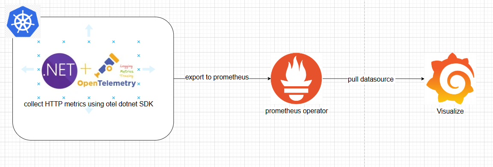
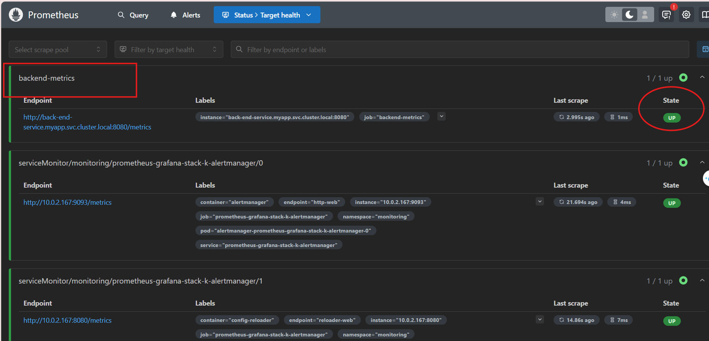
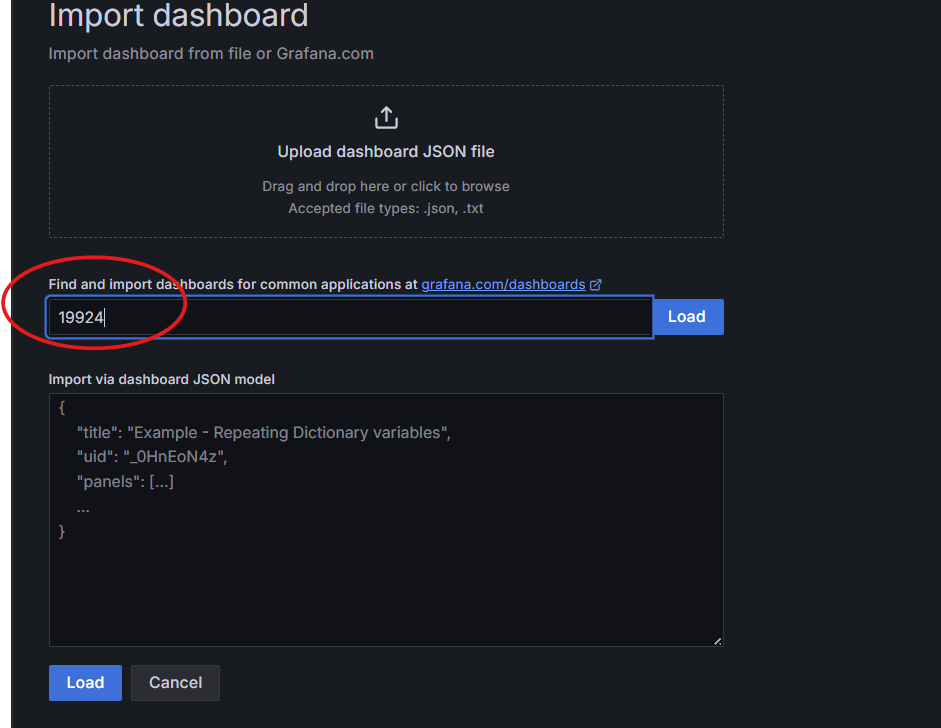
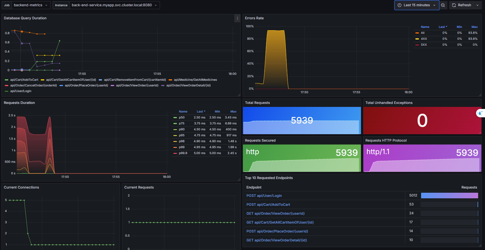

## Monitor .NET 8 Application on K8S cluster

### Tech using

*Opentelemetry SDK for .NET (http metrics)*

*Prometheus*

*Grafana*




Step 1: First, pull prometheus-grafana stack chart 

```bash
    helm repo add prometheus-community https://prometheus-community.github.io/helm-charts
    helm repo add stable https://charts.helm.sh/stable
    helm repo update
    helm pull prometheus-community/kube-prometheus-stack
```


Add job at prometheus.prometheusSpec in the values.yaml file


```bash
    additionalScrapeConfigs: 
    - job_name: 'backend-metrics'
      scheme: http
      metrics_path: /metrics 
      static_configs:
        - targets: ['back-end-service.myapp.svc.cluster.local:8080'] #your app service running on k8s cluster
      # metric_relabel_configs:
      #   - source_labels: [__name__]
      #     action: keep
      #     regex: 'http_server_*|kestrel_*|container_cpu_usage_seconds_total|container_memory_usage_bytes'
      scrape_interval: 5s

```
Install chart:

```bash

 helm -n monitoring install prometheus-grafana-stack -f values.yaml kube-prometheus-stack


```

Check prometheus and grafana:





Add Dashboard for ASP.NET and see the results:





