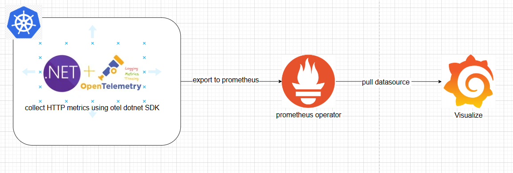
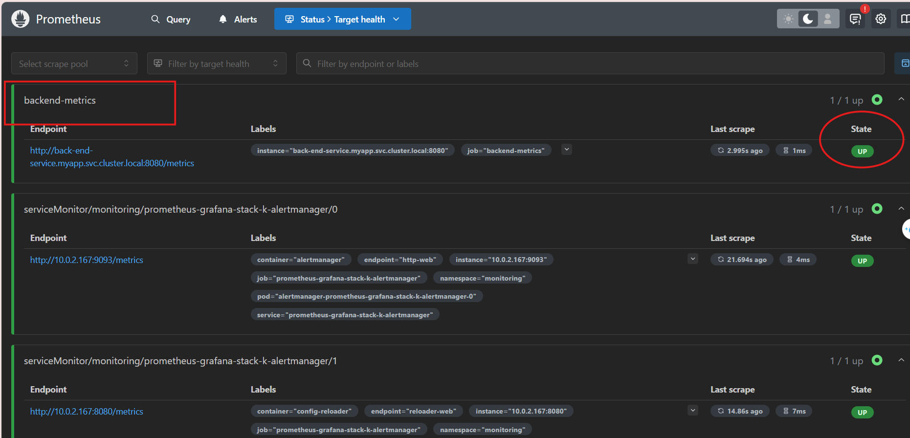
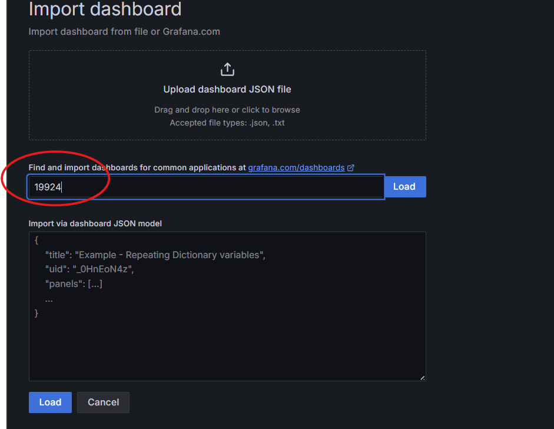
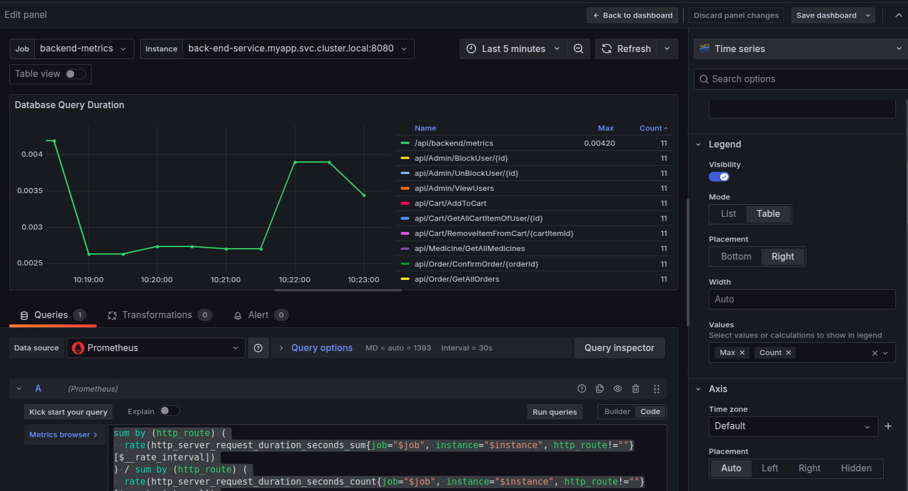
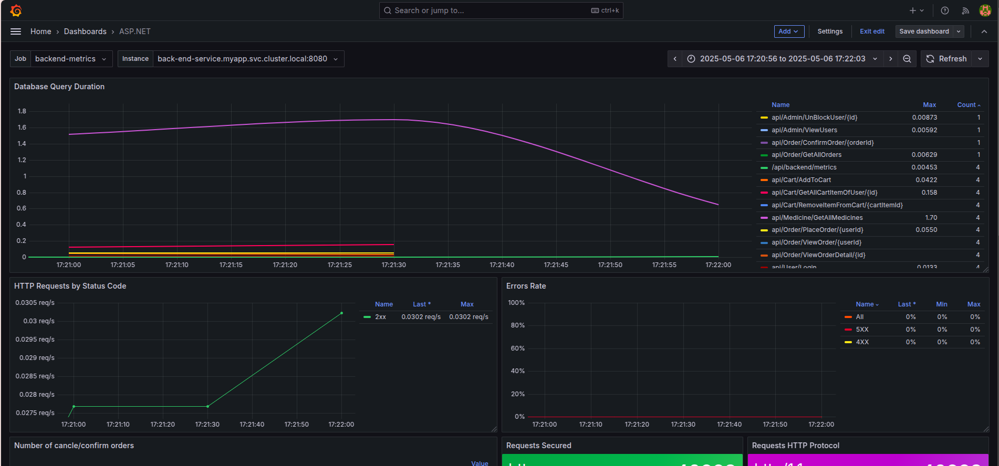
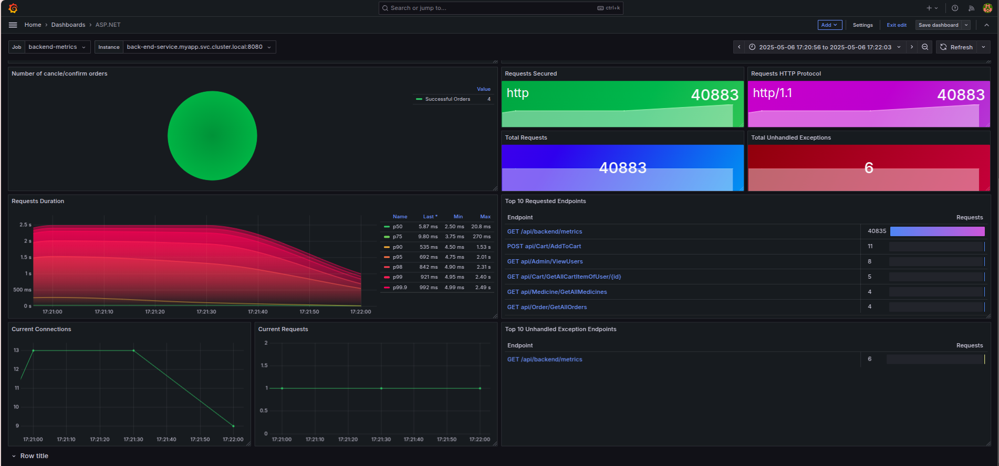

# 📈 Monitor .NET 8 Application on K8S Cluster

### 🧰 Technologies Used

- **OpenTelemetry SDK for .NET** (HTTP metrics)
- **Prometheus**
- **Grafana**



---

## 🛠 Step 1: Pull `prometheus-grafana` Stack Chart

```bash
helm repo add prometheus-community https://prometheus-community.github.io/helm-charts
helm repo add stable https://charts.helm.sh/stable
helm repo update
helm pull prometheus-community/kube-prometheus-stack
```

---

## ⚙️ Step 2: Configure Prometheus Scraping

Thêm job `backend-metrics` vào phần `prometheus.prometheusSpec` trong file `values.yaml`:

```yaml
additionalScrapeConfigs: 
  - job_name: 'backend-metrics'
    scheme: http
    metrics_path: /api/backend/metrics 
    static_configs:
      - targets: ['back-end-service.myapp.svc.cluster.local:8080'] # your app service running on k8s cluster
    # metric_relabel_configs:
    #   - source_labels: [__name__]
    #     action: keep
    #     regex: 'http_server_*|kestrel_*|container_cpu_usage_seconds_total|container_memory_usage_bytes'
    scrape_interval: 5s
```

---

## 🚀 Step 3: Install the Chart

```bash
helm -n monitoring install prometheus-grafana-stack -f values.yaml kube-prometheus-stack
```

---

## 🔍 Verify Prometheus & Grafana are Running



---

## 🧪 Add ASP.NET Dashboard & Observe Metrics




---

## 📊 Add `Max` and `Count` Columns in Grafana Panel

- Truy cập vào phần **Legend** trong panel
- Trong trường **Values**, chọn **Max** và **Count**





