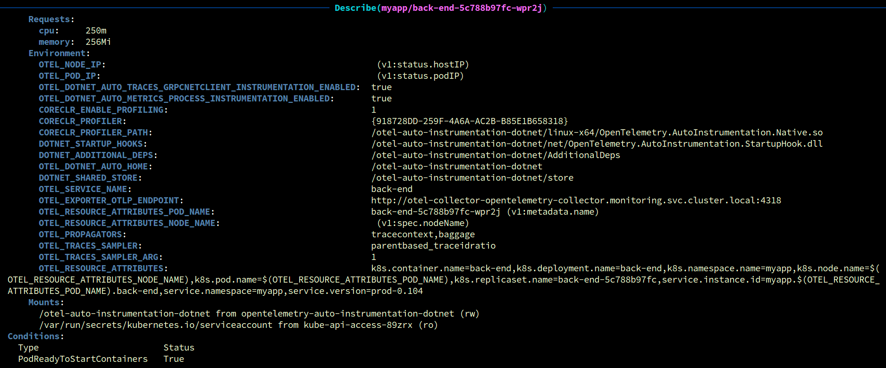
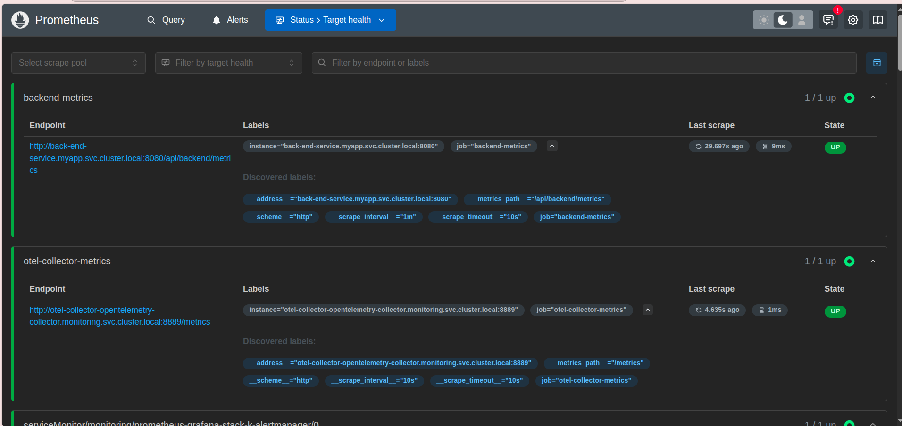
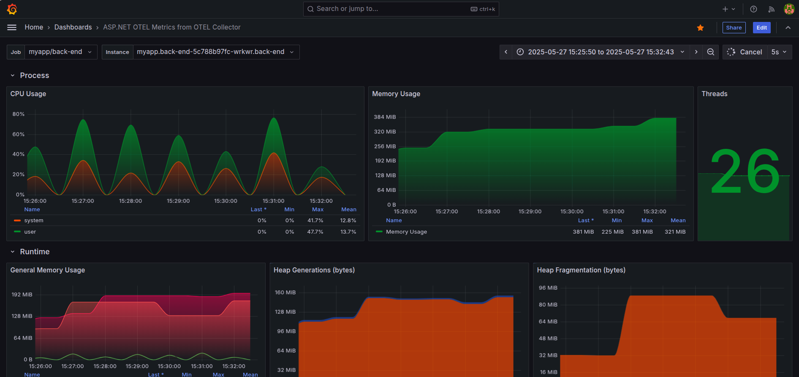
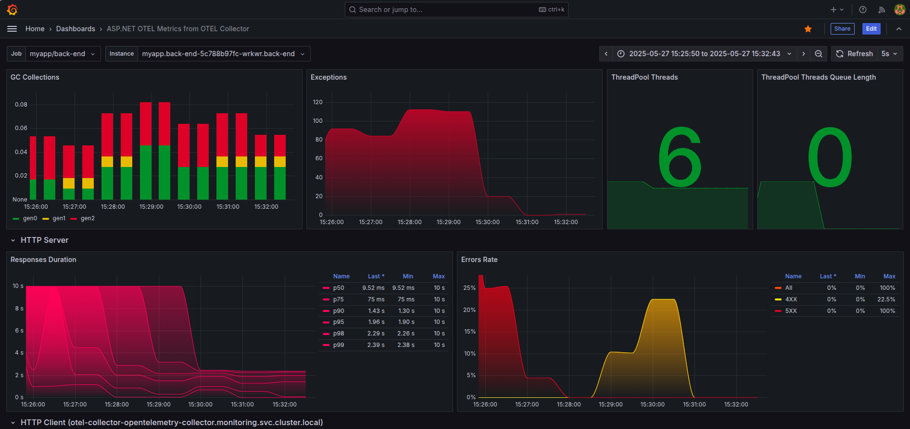
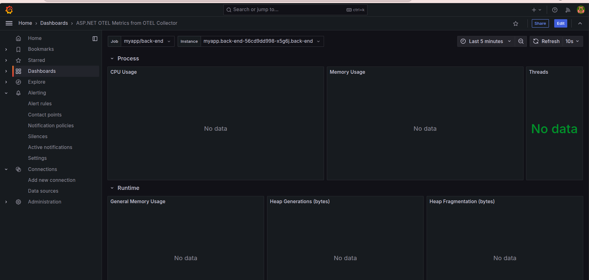
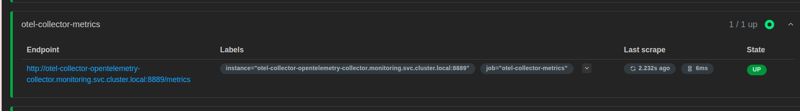

# 📈 Monitor .NET 8 Application on K8S Cluster (2 methods)

## Method 1: using dotnet SDK integrated into .Net application

### 🧰 Technologies Used

- **OpenTelemetry SDK for .NET** (HTTP metrics)
- **Prometheus**
- **Grafana**


---

## 🛠 Step 1: Pull `prometheus-grafana` Stack Chart

```bash
helm repo add prometheus-community https://prometheus-community.github.io/helm-charts
helm repo add stable https://charts.helm.sh/stable
helm repo update
helm pull prometheus-community/kube-prometheus-stack
```

---

## ⚙️ Step 2: Configure Prometheus Scraping

Add job `backend-metrics` into `prometheus.prometheusSpec` in  `values.yaml` file:

```yaml
additionalScrapeConfigs: 
  - job_name: 'backend-metrics'
    scheme: http
    metrics_path: /api/backend/metrics 
    static_configs:
      - targets: ['back-end-service.myapp.svc.cluster.local:8080'] # your app service running on k8s cluster
    # metric_relabel_configs:
    #   - source_labels: [__name__]
    #     action: keep
    #     regex: 'http_server_*|kestrel_*|container_cpu_usage_seconds_total|container_memory_usage_bytes'
    scrape_interval: 5s
```

---

## 🚀 Step 3: Install the Chart

```bash
helm -n monitoring install prometheus-grafana-stack -f values.yaml kube-prometheus-stack
```

---

## 🔍 Verify Prometheus & Grafana are Running


---

## 🧪 Add ASP.NET Dashboard & Observe Metrics


---

## 📊 Add `Max` and `Count` Columns in Grafana Panel

- Access into **Legend** on panel
- In field **Values**, select **Max** and **Count**


## Method 2: using Opentelemetry Auto-instrumentation


## 🛠 Step 1: Pull `otel-collector` and `otel-operator` Chart

```bash 
helm pull open-telemetry/opentelemetry-operator
helm pull open-telemetry/opentelemetry-collector
```

## ⚙️ Step 2: Config operator

1. Edit this field to choose repo for image pull

```bash 
  image:
  collectorImage:
    repository: "ghcr.io/open-telemetry/opentelemetry-collector-releases/opentelemetry-collector-k8s"
```    

2. Install chart

```bash
  helm install otel-operator -n monitoring opentelemetry-operator/ -f values.yaml 
```


## ⚙️ Step 3: Config collector

1. Select mode for collector (i using daemonset)

```c++
mode: "daemonset"
```

2. Config exporter, receivers, and processors

```yaml
config:
  exporters:
    prometheus:
      endpoint: ${env:MY_POD_IP}:8889


  receivers:

    otlp:
      protocols:
        grpc:
        http:
          endpoint: 0.0.0.0:4318


    pipelines:
      logs:
        exporters:
          - debug
        processors:
          - memory_limiter
          - batch
        receivers:
          - otlp
      metrics:
        exporters:
          - prometheus
        processors:
          - memory_limiter
          - batch
        receivers:
          - otlp
```      

3. Add image repo

```bash
image:
  # If you want to use the core image `otel/opentelemetry-collector`, you also need to change `command.name` value to `otelcol`.
  repository: "ghcr.io/open-telemetry/opentelemetry-collector-releases/opentelemetry-collector-contrib"
```

4. Config port to expose metrics

```bash 
ports:
    metrics:
    # The metrics port is disabled by default. However you need to enable the port
    # in order to use the ServiceMonitor (serviceMonitor.enabled) or PodMonitor (podMonitor.enabled).
    enabled: true
    containerPort: 8889
    servicePort: 8889
    protocol: TCP
```

5. Install chart 

```bash
helm install otel-collector -n monitoring  opentelemetry-collector/  -f values.yaml 
```

6. Injecting Auto-instrumentation

- To monitoring Dotnet application, to just to add theese annotations into your deployments, daemonset,...

```bash 
backEnd:
  replicaCount: 1
  name: back-end
  annotations:

    # add annotations
    sidecar.opentelemetry.io/inject: "true" 
    instrumentation.opentelemetry.io/inject-dotnet: "true"

  image:
    repository: datnd2711/pharmacy-be
    tag: prod-0.104
    pullPolicy: IfNotPresent
  imagePullSecrets:
    name: my-dockerhub-secret
  service:
    name: back-end-service
    type: ClusterIP 
    port: 8080
    targetPort: "http-backend"
  resources:
    requests:
      cpu: "250m"
      memory: "256Mi"
    limits:
      cpu: "500m"
      memory: "512Mi"
```

7. Create instrumentation for dotnet applications

```javascript 
kubectl apply -f - <<EOF
apiVersion: opentelemetry.io/v1alpha1
kind: Instrumentation
metadata:
  name: demo-dotnet-instrumentation
  namespace: myapp
spec:
  exporter:
    endpoint: http://otel-collector-opentelemetry-collector.monitoring.svc.cluster.local:4318
  propagators:
    - tracecontext
    - baggage
  sampler:
    type: parentbased_traceidratio
    argument: '1'
  dotnet:
    env:
      - name: OTEL_DOTNET_AUTO_TRACES_GRPCNETCLIENT_INSTRUMENTATION_ENABLED
        value: "true"
      - name: OTEL_DOTNET_AUTO_METRICS_PROCESS_INSTRUMENTATION_ENABLED
        value: "true"
EOF
```
> For others applications: [Configure Automatic Instrumentation](https://opentelemetry.io/docs/platforms/kubernetes/operator/automatic/#installation)


7. Result after inject




8. Add prometheus job 

- Default endpoint when using auto-Instrumentation will be **/metrics**

```bash 
    - job_name: 'otel-collector-metrics'
      scheme: http
      metrics_path: /metrics
      static_configs:
       - targets: ['otel-collector-opentelemetry-collector.monitoring.svc.cluster.local:8889']
      # metric_relabel_configs:
      #   - source_labels: [__name__]
      #     action: keep
      #     regex: 'http_server_*|kestrel_*|container_cpu_usage_seconds_total|container_memory_usage_bytes'
      scrape_interval: 10s   
________________________

helm upgrade prometheus-grafana-stack -n monitoring -f values.yaml kube-prometheus-stack/      
```       

9. Results



#### ID of this dashboard is 19896 (for dotnet only)





## Troubleshooting

1. In case of metrics don't display in Grafana like the below picture but the app still running and scrape config still **Up** status in **Prometheus**:





2. **Check logs of otel-operator pod**. If the logs display as:

> There are no opentelemetry collector instance for ....

3. Delete that pod manually

4. You can use this cronjob for auto delete **Error opentelemetry operator pod**


```go
apiVersion: batch/v1
kind: CronJob
metadata:
  name: kill-otel-operator-on-error
  namespace: monitoring
spec:
  schedule: "*/5 * * * *"
  successfulJobsHistoryLimit: 3
  failedJobsHistoryLimit: 3
  jobTemplate:
    spec:
      template:
        spec:
          serviceAccountName: otel-logs-cleaner
          containers:
          - name: checker
            image: bitnami/kubectl:latest
            command:
            - /bin/sh
            - -c
            - |
              set -e
              echo "Checking otel-operator logs..."
              for pod in $(kubectl get pods -n monitoring -l app.kubernetes.io/name=opentelemetry-operator -o jsonpath='{.items[*].metadata.name}'); do
                if kubectl logs -n monitoring "$pod" | grep -i "error"; then
                  echo "Found error in $pod logs. Deleting pod..."
                  kubectl delete pod "$pod" -n monitoring
                else
                  echo "$pod is clean."
                fi
              done
          restartPolicy: OnFailure
---
apiVersion: v1
kind: ServiceAccount
metadata:
  name: otel-logs-cleaner
  namespace: monitoring
---
apiVersion: rbac.authorization.k8s.io/v1
kind: Role
metadata:
  name: otel-logs-cleaner-role
  namespace: monitoring
rules:
- apiGroups: [""]
  resources: ["pods", "pods/log"]
  verbs: ["get", "list", "delete"]
---
apiVersion: rbac.authorization.k8s.io/v1
kind: RoleBinding
metadata:
  name: otel-logs-cleaner-binding
  namespace: monitoring
subjects:
- kind: ServiceAccount
  name: otel-logs-cleaner
  namespace: monitoring
roleRef:
  kind: Role
  name: otel-logs-cleaner-role
  apiGroup: rbac.authorization.k8s.io


```